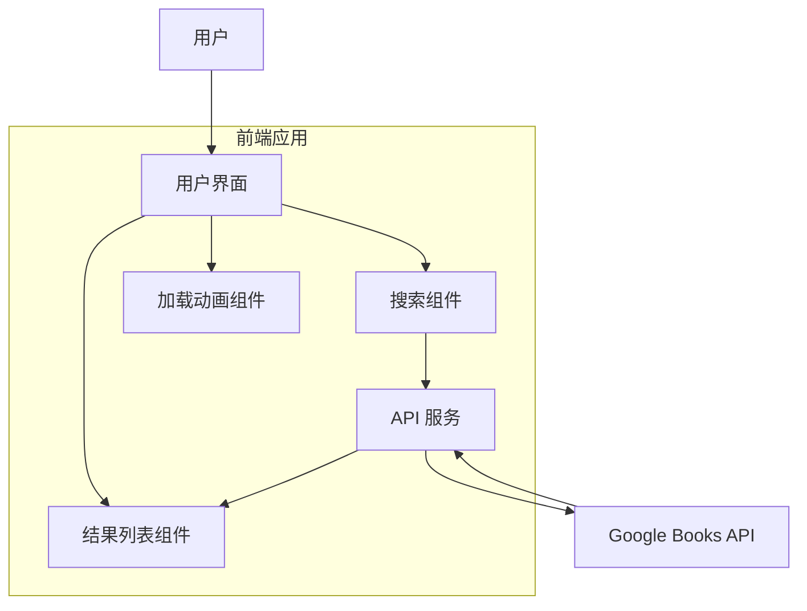
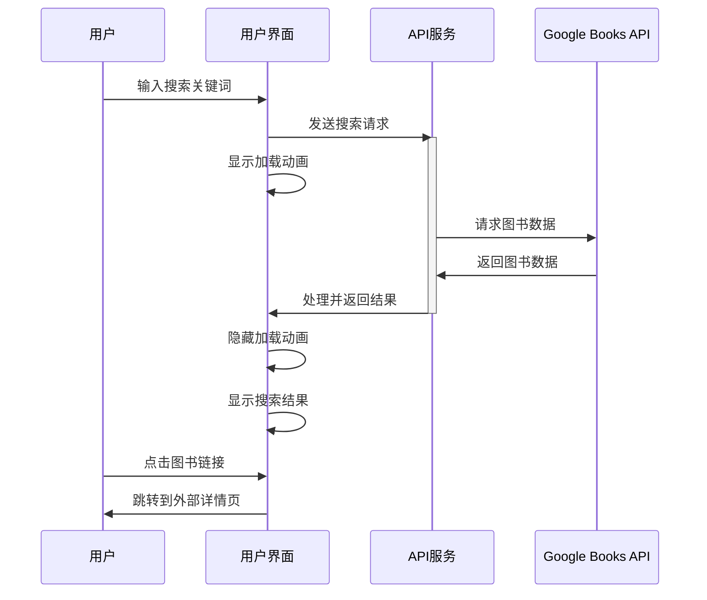

# Architecture for Book Finder App

Status: Approved

## Technical Summary

Book Finder App 是一个基于 Vue 3 和 Tailwind CSS 的单页面应用程序，它利用 Google Books API 允许用户搜索并查看图书信息。应用采用组件化架构，使用 TypeScript 确保类型安全，并通过 Vite 构建工具实现快速的开发和构建过程。

## Technology Table

| Technology     | Description                                       |
| -------------- | ------------------------------------------------- |
| Vue 3          | 前端渐进式框架，使用 Composition API              |
| TypeScript     | 静态类型语言，提供类型安全和更好的开发体验        |
| Tailwind CSS   | 实用类优先的 CSS 框架，便于构建响应式界面         |
| Vite           | 现代前端开发与构建工具，提供快速的开发体验        |
| Axios          | 基于 Promise 的 HTTP 客户端，用于调用 API         |
| Google Books API | 提供图书搜索和信息查询功能的外部 API             |

## Architectural Diagrams

### 应用架构



### 数据流程



## Data Models, API Specs, Schemas

### Book 数据模型

```typescript
interface Book {
  id: string;
  volumeInfo: {
    title: string;
    authors: string[];
    publishedDate: string;
    description: string;
    imageLinks?: {
      thumbnail: string;
      smallThumbnail: string;
    };
    infoLink: string;
    categories?: string[];
    pageCount?: number;
    averageRating?: number;
  };
}

interface SearchResponse {
  items: Book[];
  kind: string;
  totalItems: number;
}
```

### API 调用

```typescript
// 搜索图书 API
const searchBooks = async (query: string): Promise<SearchResponse> => {
  try {
    const response = await axios.get(
      `https://www.googleapis.com/books/v1/volumes?q=${encodeURIComponent(query)}`
    );
    return response.data;
  } catch (error) {
    console.error("Error fetching books:", error);
    throw error;
  }
};
```

## Project Structure

```
book-finder-app/
├── public/                # 静态资源
├── src/
│   ├── api/               # API 服务
│   │   └── searchbooks.ts # 搜索图书 API 方法
│   ├── assets/            # 图片和样式资源
│   ├── components/        # Vue 组件
│   ├── http/              # HTTP 客户端配置
│   │   └── index.ts       # Axios 实例配置
│   ├── router/            # Vue Router 配置
│   ├── services/          # 服务层
│   ├── stores/            # Pinia 状态管理
│   │   └── bookStore.ts   # 图书搜索状态管理
│   ├── views/             # 视图组件
│   │   └── HomeView.vue   # 主页（包含搜索和结果展示）
│   ├── App.vue            # 应用入口组件
│   └── main.ts            # Vue 应用入口文件
├── .env                   # 环境变量文件（新增，用于API密钥配置）
├── .env.example           # 环境变量示例（新增，用于开源项目）
├── index.html             # 项目 HTML 入口
├── package.json           # 项目依赖配置
├── tailwind.config.js     # Tailwind 配置
├── tsconfig.json          # TypeScript 配置
├── tsconfig.app.json      # TypeScript 应用配置
├── tsconfig.node.json     # TypeScript Node 配置
├── vite.config.ts         # Vite 配置
└── eslint.config.ts       # ESLint 配置
```

## API 密钥管理

为了保护 API 密钥并确保项目可以安全地开源，我们将采用以下方法：

1. 使用环境变量来存储 API 密钥
2. 在 `.env` 文件中配置敏感信息
3. 将 `.env` 添加到 `.gitignore` 以避免上传到公共仓库
4. 提供 `.env.example` 文件作为模板，供其他开发者配置自己的 API 密钥
5. 在文档中说明如何获取和配置 API 密钥

## Infrastructure

- 前端：使用静态网站托管服务如 Netlify、Vercel 或 GitHub Pages
- CI/CD：使用 GitHub Actions 自动化部署流程
- Google Books API：使用免费层级，无需支付费用

## Deployment Plan

1. 开发环境：本地开发和测试
2. 构建阶段：使用 Vite 构建生产版本
3. 部署阶段：部署至静态托管服务
   - 在部署过程中可以配置环境变量来提供 API 密钥

## Change Log

| Change        | Story ID | Description                |
| ------------- | -------- | -------------------------- |
| Initial draft | N/A      | 创建初始架构文档           |
| Update        | N/A      | 更新项目结构和 API 密钥管理 | 