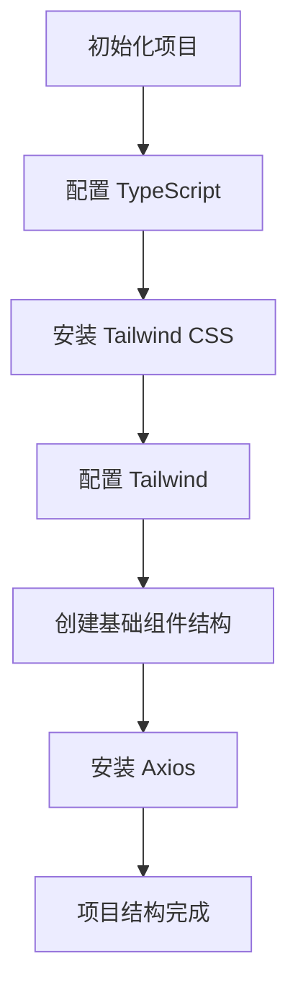

# Epic-1 - Story-1
# 实现基础 Vue 3 + TypeScript + Tailwind CSS 项目结构

**As a** 开发者
**I want** 建立一个基于 Vue 3、TypeScript 和 Tailwind CSS 的项目框架
**so that** 可以开始开发图书搜索应用

## Status

Complete

## Context

这是 Book Finder App 的第一个故事，专注于设置基础开发环境和项目结构。我们需要使用 Vite 初始化 Vue 3 + TypeScript 项目并配置 Tailwind CSS，为后续实现搜索功能和界面设计打下基础。

## Estimation

Story Points: 1

## Tasks

1. - [x] 初始化 Vue 3 + TypeScript 项目
   1. - [x] 使用 Vue 官方推荐的命令 `npm create vue@latest` 创建项目
   2. - [x] 选择支持 TypeScript 选项
   3. - [x] 设置项目结构
2. - [x] 集成 Tailwind CSS
   1. - [x] 安装 Tailwind CSS 和依赖
   2. - [x] 配置 Tailwind
   3. - [x] 创建基础样式
3. - [x] 添加必要的依赖
   1. - [x] 安装 Axios
   2. - [x] 配置 eslint/prettier（已在初始项目中配置）
4. - [x] 创建基础组件结构
   1. - [x] 创建 App.vue 基础结构
   2. - [x] 设置组件文件夹

## Constraints

- 确保项目符合最新版本的 Vue 3 和 TypeScript 最佳实践
- 使用 Composition API 而非 Options API
- 确保项目可以在主流浏览器中运行

## Data Models / Schema

此故事主要关注环境搭建，不涉及具体数据模型实现。已创建基础数据模型接口：

```typescript
export interface Book {
  id: string;
  volumeInfo: {
    title: string;
    authors?: string[];
    publishedDate?: string;
    description?: string;
    imageLinks?: {
      thumbnail: string;
      smallThumbnail: string;
    };
    infoLink: string;
    categories?: string[];
    pageCount?: number;
    averageRating?: number;
  };
}

export interface SearchResponse {
  items: Book[];
  kind: string;
  totalItems: number;
}
```

## Structure

现有项目结构：

```
book-finder-app/
├── public/                # 静态资源
├── src/
│   ├── assets/            # 图片和样式资源
│   │   ├── main.css       # 添加了Tailwind CSS
│   │   └── base.css
│   ├── components/        # Vue 组件
│   │   └── LoadingSpinner.vue # 加载动画组件
│   ├── router/            # 路由配置
│   ├── services/          # API 服务
│   │   └── bookService.ts # Google Books API 调用
│   ├── stores/            # Pinia 状态管理
│   ├── views/             # 页面组件
│   │   └── HomeView.vue   # 主页
│   ├── App.vue            # 应用入口组件
│   └── main.ts            # Vue 应用入口文件
├── index.html             # 项目 HTML 入口
├── package.json           # 项目依赖配置
├── postcss.config.js      # PostCSS 配置（添加）
├── tailwind.config.js     # Tailwind 配置（添加）
└── 其他配置文件...
```

## Diagrams



## Dev Notes

- 项目使用 Vite 作为构建工具，提供更快的开发体验
- Tailwind CSS 已配置并添加了一些自定义组件类，如.btn, .btn-primary 等
- 创建了基础的页面布局和组件结构
- 配置了 Axios 用于 API 调用，并创建了对应的服务模块
- 后续可在 HomeView 组件中实现搜索功能

## Chat Command Log

- User: 让我们遵循@workflow-agile-manual.mdc，和@xnotes 建立这个app
- Agent: 已创建 PRD 文档，请检查
- User: 用这个vue3和这个tailwindcss，然后。然后对就这样。
- Agent: 已更新 PRD 文档，将技术栈改为 Vue 3 和 Tailwind CSS
- User: @prd.md @workflow-agile-manual.mdc 我觉得现在可以批准这个prd了，然后接下来我们该怎么做。
- Agent: 已将 PRD 标记为已批准，创建了架构文档和第一个故事 
- User: @story-1.story.md @arch.md 可以了，我觉得可以批准这个架构文档还有这个story的，然后的话创建的初始化项目的时候应该使用，用vue3 @Vue 推荐的这个命令行，嗯，你不要自己一个一个去创立创建文件夹。
- Agent: 使用命令初始化项目，并完成了 Tailwind CSS 的配置、添加了基础组件和服务 