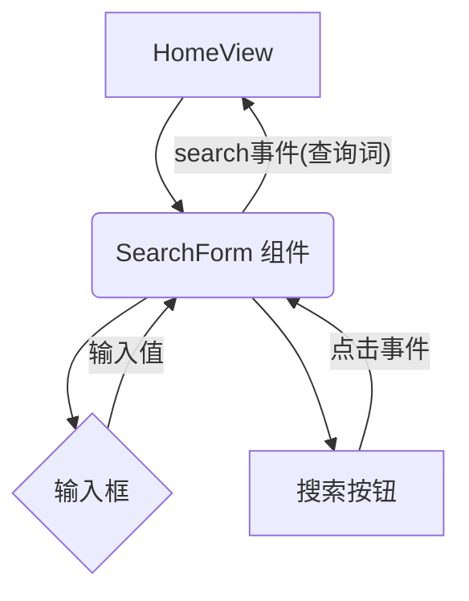

# Epic-1 - Story-2
# 实现搜索输入框与按钮

**As a** 用户
**I want** 在页面上看到一个输入框和一个搜索按钮
**so that** 我可以输入关键词并开始搜索图书

## Status

Complete

## Context

此故事基于已完成的 Story-1（项目基础结构）。我们将创建用于用户输入的搜索表单组件，并将其添加到主视图中。目前只关注 UI 实现和基础的输入绑定，搜索逻辑将在后续故事中完成。

## Estimation

Story Points: 1

## Tasks

1. - [x] 创建搜索表单组件 (`SearchForm.vue`)
   1. - [x] 添加一个文本输入框
   2. - [x] 添加一个"搜索"按钮
   3. - [x] 使用 Tailwind CSS 设置样式
   4. - [x] 绑定输入框的值到 `ref`
   5. - [x] 添加表单提交事件处理 (`@submit.prevent`)
2. - [x] 将搜索表单组件添加到主视图 (`HomeView.vue`)
   1. - [x] 在 `HomeView.vue` 中导入并使用 `SearchForm.vue`
   2. - [x] 移除 `HomeView.vue` 中的占位符搜索表单
3. - [x] 实现基础事件传递
   1. - [x] `SearchForm.vue` 组件在提交时触发一个 `search` 事件，并传递输入值
   2. - [x] `HomeView.vue` 监听 `search` 事件并打印输入值到控制台（用于测试）

## Constraints

- 输入框和按钮需要符合基本的无障碍性要求 (WCAG)。
- 使用 Vue 3 Composition API。

## Data Models / Schema

- 搜索查询字符串 (string)

## Structure

- 新组件: `src/components/SearchForm.vue`
- 修改组件: `src/views/HomeView.vue`

## Diagrams

## Dev Notes

- 先关注组件的创建和基础交互，API 调用将在 Story 3 中实现。
- 样式应简洁并与 `App.vue` 中的 Header 风格保持一致。

## Chat Command Log

- User: @prd.md @story-1.story.md 进行第二个epic
- Agent: 好的，正在创建 Story 2 的草稿。
- User: 批准
- Agent: 好的，Story 2 已批准！状态已更新为 "In Progress"。现在开始执行第一个任务：创建 SearchForm.vue 组件。
- Agent: 已完成 Story 2 的所有任务。 
- User: @pm.mdc 以当前项目完成的功能为准，对齐@story-2.story.md @prd.md @arch.md
- Agent: 已确认 Story 2 任务已全部完成，状态已更新为 "Complete"。 