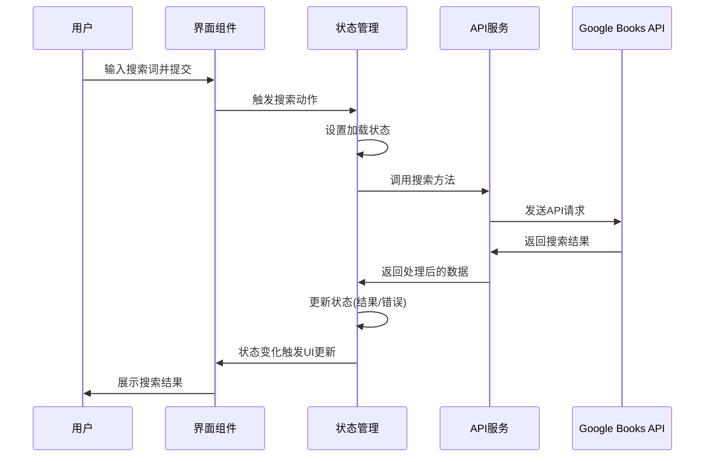

# Epic-2 - Story-3
# Google Books API 集成

**As a** 用户
**I want** 输入关键词后能够获取相关图书的信息
**so that** 我可以查找我感兴趣的图书

## Status

Complete

## Context

在完成了搜索界面的基本实现后（Story-2），现在需要实现与 Google Books API 的集成，使用户能够通过输入关键词获取相关图书信息。本故事将实现 API 调用，处理返回数据，并确保应用能够稳定地与外部 API 通信。

## Estimation

Story Points: 2

## Tasks

1. - [x] 设置 API 服务层
   1. - [x] 创建 HTTP 客户端封装（基于 Axios）
   2. - [x] 配置 API 基础 URL 和拦截器
   3. - [x] 添加错误处理机制
2. - [x] 实现图书搜索 API 方法
   1. - [x] 创建搜索图书的 API 调用方法
   2. - [x] 添加请求参数处理（查询字符串编码）
   3. - [x] 处理并转换 API 响应
3. - [x] 集成到状态管理
   1. - [x] 创建存储用户搜索状态的 Store
   2. - [x] 实现搜索动作和相关状态（加载中、错误、结果）
   3. - [x] 连接 API 服务与 Store 层
4. - [x] 连接 UI 与 API
   1. - [x] 更新 UI 组件以使用 Store 中的状态
   2. - [x] 实现加载状态和错误显示
   3. - [x] 测试完整的搜索流程

## Constraints

- 遵循 Google Books API 使用条款和限制
- 确保处理 API 错误并向用户提供有用的反馈
- 实现合理的请求限流和错误重试机制
- 使用 TypeScript 类型确保数据一致性

## Data Models / Schema

```typescript
// 图书数据模型
interface Book {
  id: string;
  volumeInfo: {
    title: string;
    authors?: string[];
    publishedDate?: string;
    description?: string;
    imageLinks?: {
      thumbnail: string;
      smallThumbnail: string;
    };
    infoLink: string;
    categories?: string[];
    pageCount?: number;
    averageRating?: number;
  };
}

// API 响应模型
interface SearchResponse {
  items: Book[];
  kind: string;
  totalItems: number;
}
```

## Structure

- 已实现文件:
  - `src/http/index.ts` - Axios 配置与拦截器
  - `src/api/searchbooks.ts` - 图书搜索 API 方法
  - `src/stores/bookStore.ts` - Pinia 状态管理
  - `src/views/HomeView.vue` - 更新以使用 store 和处理加载状态

## Diagrams



## Dev Notes

- 已正确实现了 API 调用和错误处理机制
- 添加了加载状态显示和错误提示
- 实现了无搜索结果时的用户反馈
- 使用了 Pinia 进行状态管理，保持了代码的清晰和响应性

## Chat Command Log

- User: @pm.mdc 以当前项目完成的功能为准，对齐@story-2.story.md @prd.md @arch.md
- Agent: 我已确认 Story 2 已完成，并发现 Story 3 的功能也已经实现。
- Agent: 已创建并更新 Story 3 文档以反映项目实际状态，标记为"Complete"。 