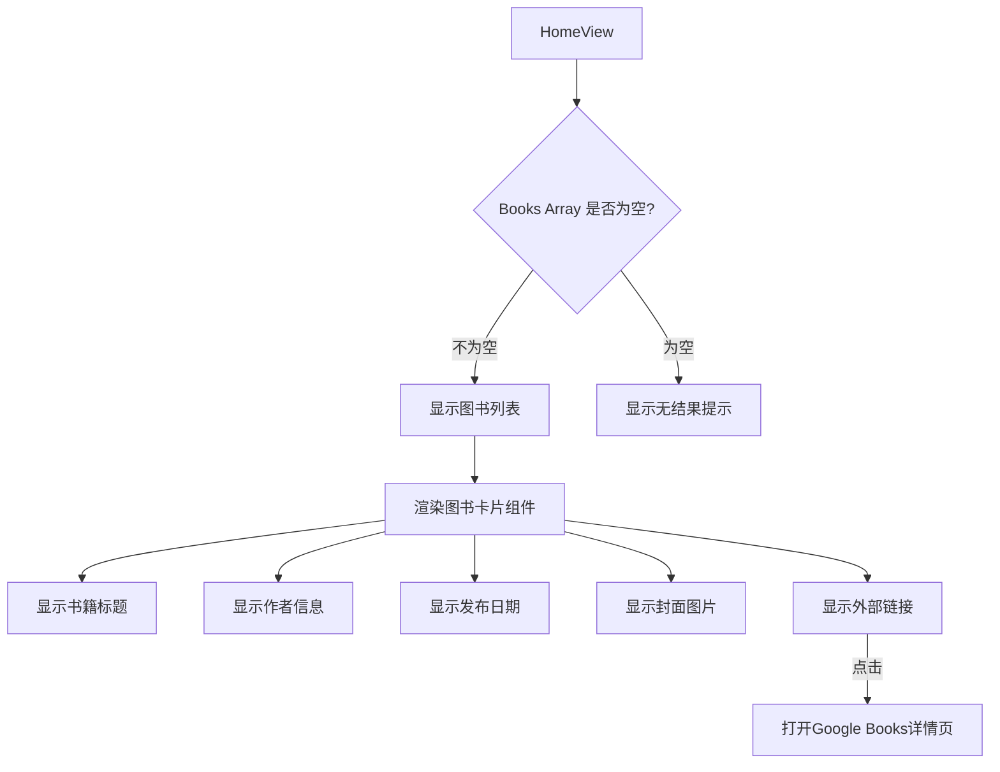

# Epic-3 - Story-4
# 列表展示与外部链接

**As a** 用户
**I want** 查看搜索结果并能够获取更多图书详情
**so that** 我可以找到感兴趣的图书并了解更多信息

## Status

Complete

## Context

在完成了 Google Books API 集成后（Story-3），我们需要将返回的图书数据以列表形式展示给用户，并提供外部链接让用户了解更多图书详情。本故事将实现搜索结果的展示组件及外部链接功能。

## Estimation

Story Points: 2

## Tasks

1. - [x] 实现图书列表展示
   1. - [x] 创建图书列表组件，显示每本书的标题、作者、出版日期
   2. - [x] 添加图书封面图片显示
   3. - [x] 实现响应式网格布局
   4. - [x] 处理图片加载失败的备用显示
2. - [x] 添加外部链接
   1. - [x] 为每个图书项添加"更多信息"链接
   2. - [x] 配置链接在新标签页打开
   3. - [x] 添加适当的视觉指示器
3. - [x] 处理不同展示情况
   1. - [x] 实现无搜索结果时的提示
   2. - [x] 添加加载状态的视觉反馈
   3. - [x] 实现搜索错误提示
4. - [x] 优化列表体验
   1. - [x] 添加动画效果
   2. - [x] 实现卡片悬停效果
   3. - [x] 优化移动端显示布局

## Constraints

- 确保图书列表在不同屏幕尺寸下都有良好的可读性
- 外部链接必须通过 rel="noopener noreferrer" 确保安全性
- 图片加载时应显示加载状态或占位符
- 卡片设计应统一并符合整体视觉风格

## Data Models / Schema

使用与 Story-3 中定义的相同数据模型：

```typescript
interface Book {
  id: string;
  volumeInfo: {
    title: string;
    authors?: string[];
    publishedDate?: string;
    description?: string;
    imageLinks?: {
      thumbnail: string;
      smallThumbnail: string;
    };
    infoLink: string;
    categories?: string[];
    pageCount?: number;
    averageRating?: number;
  };
}
```

## Structure

- 已实现文件:
  - `src/views/HomeView.vue` - 包含图书列表展示和外部链接功能
  - 图书卡片组件直接整合在了 HomeView 中，使用内联模板结构

## Diagrams



## Dev Notes

- 列表采用了响应式网格布局，在不同屏幕尺寸下自动调整列数
- 图书卡片使用了阴影和悬停效果增强交互体验
- 外部链接使用了新窗口打开，避免中断用户的搜索体验
- 实现了图片加载失败时的备用显示功能

## Chat Command Log

- User: @pm.mdc 以当前项目完成的功能为准，对齐@story-2.story.md @prd.md @arch.md
- Agent: 我已确认 Story 2 和 Story 3 已完成，并创建了 Story 4 文档以反映项目中已实现的列表展示与外部链接功能。 