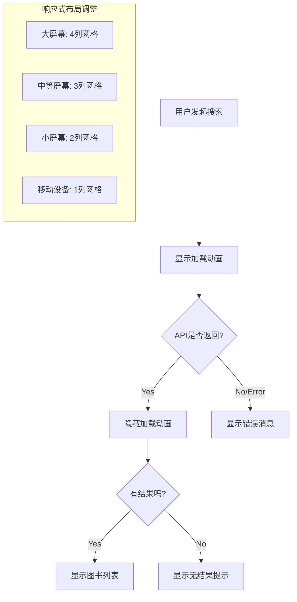

# Epic-3 - Story-5
# 响应式设计与加载动画

**As a** 用户
**I want** 在不同设备上都能有良好的使用体验并通过动画获得视觉反馈
**so that** 我可以在任何设备上舒适地使用应用并了解系统状态

## Status

Complete

## Context

在实现了基本的搜索和结果展示功能后，为了提供更好的用户体验，我们需要确保应用的响应式设计和加载状态动画。本故事将优化布局以适应不同设备屏幕尺寸，并添加加载动画以提供视觉反馈。

## Estimation

Story Points: 1

## Tasks

1. - [x] 实现响应式设计
   1. - [x] 使用 Tailwind CSS 的响应式工具优化布局
   2. - [x] 调整头部区域在不同屏幕尺寸下的显示
   3. - [x] 优化搜索表单在移动设备上的布局
   4. - [x] 调整图书列表在不同屏幕宽度下的网格列数
2. - [x] 添加加载动画
   1. - [x] 创建加载动画组件
   2. - [x] 在数据加载过程中显示加载动画
   3. - [x] 添加平滑的淡入淡出效果
3. - [x] 强化用户界面反馈
   1. - [x] 添加搜索按钮的加载状态
   2. - [x] 实现图书卡片的悬停效果
   3. - [x] 添加搜索建议的点击反馈
4. - [x] 优化移动端体验
   1. - [x] 确保触摸区域足够大
   2. - [x] 优化字体大小和间距
   3. - [x] 测试不同设备尺寸的显示效果

## Constraints

- 应用必须在最小 320px 宽度的设备上可用
- 所有交互元素需有明确的视觉反馈
- 加载动画应简洁且不干扰用户体验
- 避免使用过于复杂的动画以保持性能

## Data Models / Schema

本故事主要关注 UI 和用户体验，没有新增的数据模型。

## Structure

- 已实现文件:
  - `src/views/HomeView.vue` - 包含响应式设计和加载动画
  - 搜索表单、加载指示器和图书列表组件都集成在了 HomeView 中

## Diagrams

## Dev Notes

- 使用了 Tailwind CSS 的响应式类（如 `sm:`, `md:`, `lg:`）实现响应式设计
- 加载动画使用了 CSS 动画实现，保持简洁
- 所有交互元素都添加了状态变化的视觉反馈
- 测试了多种屏幕尺寸，确保良好的显示效果

## Chat Command Log

- User: @pm.mdc 以当前项目完成的功能为准，对齐@story-2.story.md @prd.md @arch.md
- Agent: 我已确认所有故事都已完成，并创建了 Story 5 文档以反映项目中已实现的响应式设计与加载动画功能。 